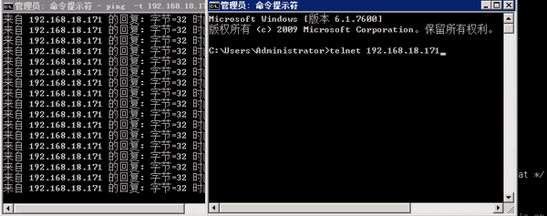
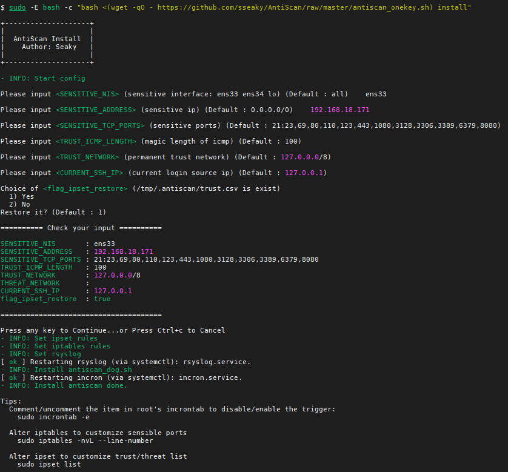
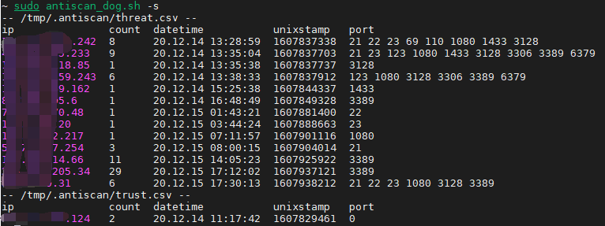
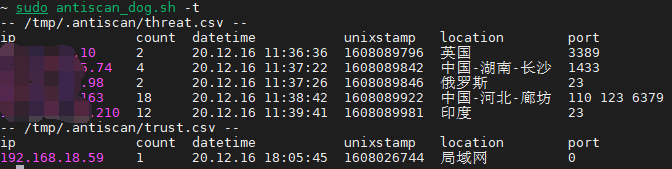

# About

The project will deploy a mechanism on server to anti port scanner.

The malicious scanner who try to inspect the sensitive ports of server will be logged with iptables and be added into blacklist by incron task immediately for certain time.

Test on **Ubuntu/Debian**.




# **Install**

```bash
sudo -E bash -c "bash <(wget -qO - https://github.com/sseaky/AntiScan/raw/master/antiscan_onekey.sh) install"
```

or

```bash
wget https://github.com/sseaky/AntiScan/raw/master/antiscan_onekey.sh
sudo -E bash antiscan_onekey.sh install
```



# Magic Ping

There is a magic length to set up on installment, If user want to add current client to trust list, just send the a ICMP packet with the payload of magic length (default 100).

##### Windows:

```
ping -l 100 x.x.x.x
```

##### Linux/Mac

```
ping -s 100 x.x.x.x
```

The length in iptable rules is **28 bytes** larger than magic ping, because it generally includes 20 bytes IP heads and 8 bytes ICMP header.

# Usage

```bash
$ antiscan_dog.sh -h

Usage:
  -d    Debug mode
  -r    Run
  -s    Show statistic
  -t    Show statistic with location, need python >= 3.5
  -f    Log file. default /var/log/antiscan.log
  -w    Parse whole log file
  -x    Remove trust ip
  -y    Remove threat ip

Tips:
  Show statistic
    sudo antiscan_dog.sh -s

  Comment/uncomment the item in root's incrontab to disable/enable the trigger:
    sudo incrontab -e

  Alter iptables to customize sensible ports
    sudo iptables -nvL --line-number

  Alter ipset to customize trust/threat list
    sudo ipset list

```



If python3 is available, it can display location with -t.



# Update

```bash
sudo -E bash -c "bash <(wget -qO - https://github.com/sseaky/AntiScan/raw/master/antiscan_onekey.sh) update"
```


# Note

### tail: inotify resources exhausted

Append to /etc/sysctl.php

```
fs.inotify.max_user_watches = 1048576
fs.inotify.max_user_instances = 1048576
```

\# sysctl -p


# 2022.1.29

use antissh.sh to ban the ip of ssh brute-force

add to incrontab (immediately)

```
/var/log/btmp   IN_MODIFY     flock -xn /root/.antissh.lock bash /usr/bin/antissh.sh
```

add to crontab (periodically)

```
*/5 * * * * /usr/bin/antissh.sh
```


